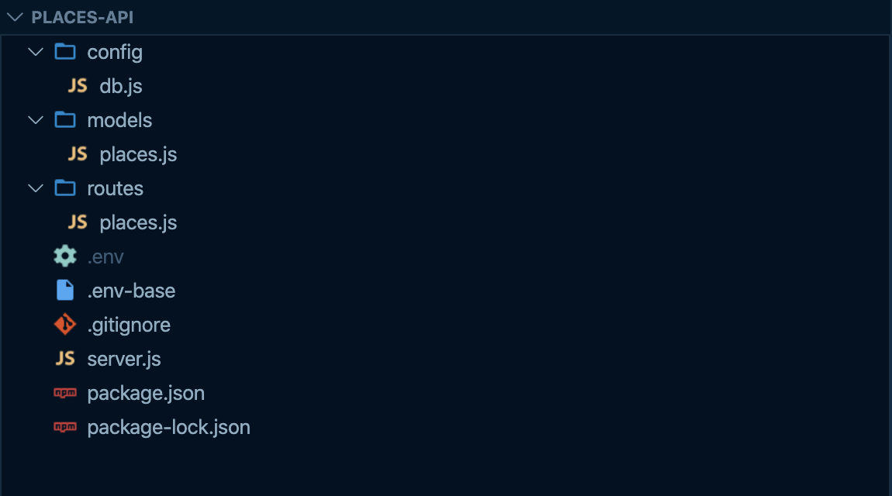
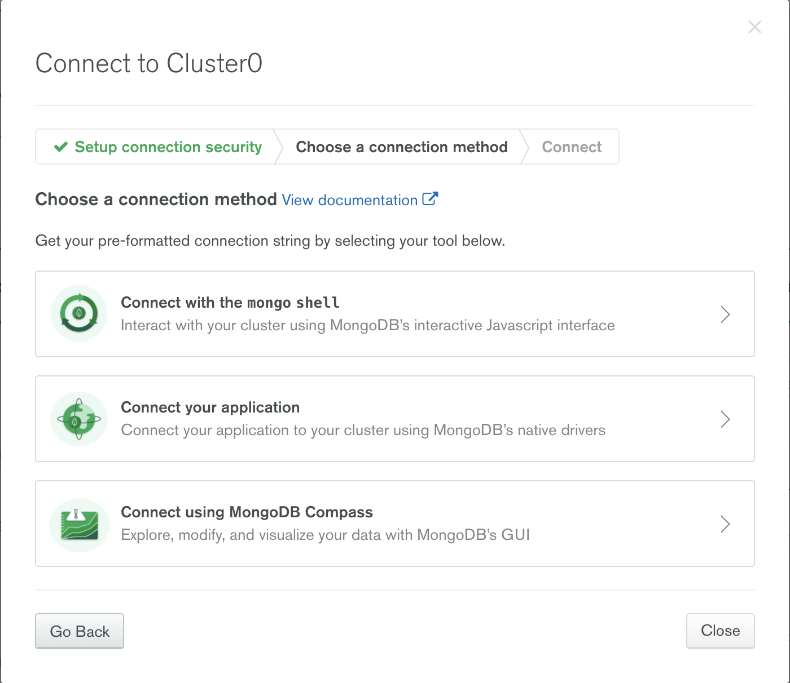

Agarraos los machos porque nos ponemos serios. Este artículo es la continuación de un artículo anterior donde veíamos [una introducción a las Geospatial Queries de MongoDB](https://73nko.es/geospatial-queries/). Esta vez, vamos a usar la pequeña base de datos que habíamos creado junto a NodeJS para disponer de una API que nos permita buscar lugares cercanos a un punto mediante una petición HTTP.

## Montamos la estructura de nuestra aplicación



Esta es la estructura de ficheros con la que vamos a trabajar. Podemos verla en más detalle [aquí](https://github.com/73nko/places-api).
Pero vamos por partes, en primer lugar vamos a crear una app node a través del comando `npm init -y`. Le damos un nombre al proyecto, en mi caso ha sido `geospacial-mongodb-api`, dejamos todo lo demás por defecto.

Nuestro siguiente paso será instalar las dependencias que vamos a utilizar. Para el servidor usaremos [express](https://expressjs.com/es/) uno de los frameworks más conocidos de NodeJS junto a [mongoose](https://mongoosejs.com/), que nos permitirá conectarnos a nuestra bbdd de MongoDB y trabajar con ella. Además utilizaremos algunas otras librerías de utilidades relacionadas.
Vamos a instalarlas! Para ello, utilizamos el siguiente comando:

```bash
npm i --save express cors body-parser mongoose mongoose-unique-validator mongoose-validator dotenv nodemon
```

Ahora que tenemos todo lo necesario, podemos ponernos manos a la obra.

## Creamos el servidor de express

Vamos a empezar creando nuestro servidor básico con express en nuestro fichero `server.js` .

```js
const express = require("express");
const bodyParser = require("body-parser");
const cors = require("cors");


// Instantiate express
const app = express();

// Set public folder using built-in express.static middleware
app.use(express.static("public"));

// Set body parser middleware
app.use(bodyParser.json());

// Enable cross-origin access through the CORS middleware
// NOTICE: For React development server only!
if (process.env.CORS) {
  app.use(cors());
}


// Use express's default error handling middleware
app.use((err, req, res, next) => {
  if (res.headersSent) return next(err);
  res.status(400).json({ err: err });
});

// Start the server
const port = process.env.PORT || 3000;

app.listen(port, () => {
  console.log(`Listening on port ${port}`);
});
```

Esta es la configuración básica de express. No tiene nada en especial y, si corremos el comando `node server.js`, deberíamos ver en consola el mensaje de que nuestro servidor está escuchando en el puerto 3000. Ya tenemos casi la mitad del trabajo hecho!

## Conectar MongoDB a NodeJS

El siguiente paso es conectar nuestra base de datos de MongoDB a la aplicación de Node. Para ello utilizaremos `mongoose` pero, antes de eso, vamos a necesitar conocer los datos de conexión a la Base de Datos. Los que seguisteis el post anterior, recordaréis que la tenemos alojada en el servicio de mongo cloud llamado Atlas.

Para encontrar los datos de conexión vamos al [panel de administración de Atlas](https://cloud.mongodb.com/v2) y, en el cluster que creamos, vemos un botón que dice `connect`, pulsamos y nos aparecerá un modal como el siguiente:



Seleccionamos la segunda opción (`connect your application`) y nos copiamos la cadena de conexión que nos dan: será algo parecido a:

`mongodb+srv://usuario1:password1112@$clusterMongo.mongodb.net/test?retryWrites=true&w=majority`

En esta cadena he  sustituido los datos personales de `usuario`, `password` y `cluster` por datos fake para mantener la privacidad. En un caso real, estos datos privados deberíamos a guardarlos en un fichero .env y obtenerlos a través de variables de entorno.

Con esta información vamos a actualizar nuestro fichero de `server.js` y conectarnos a nuestro MongoDB.

const express = require("express");

```js
const express = require("express");
const bodyParser = require("body-parser");
const cors = require("cors");

// NUEVO CÓDIGO PARA CONECTAR A MONGO
const mongoose = require("mongoose");

const conexionString = 'mongodb+srv://usuario1:password1112@$clusterMongo.mongodb.net/test?retryWrites=true&w=majority';
// Use Node's default promise instead of Mongoose's promise library
mongoose.Promise = global.Promise;

// Connect to the database
mongoose.connect(conexionString, {
  useNewUrlParser: true,
  useUnifiedTopology: true,
});
let db = mongoose.connection;

db.on("open", () => {
  console.log("Connected to the database.");
});

db.on("error", (err) => {
  console.log(`Database error: ${err}`);
});


// FIN DE LA CONEXIÓN A MONGO

// Instantiate express
const app = express();

// Set public folder using built-in express.static middleware
app.use(express.static("public"));

// Set body parser middleware
app.use(bodyParser.json());

// Enable cross-origin access through the CORS middleware
// NOTICE: For React development server only!
if (process.env.CORS) {
  app.use(cors());
}


// Use express's default error handling middleware
app.use((err, req, res, next) => {
  if (res.headersSent) return next(err);
  res.status(400).json({ err: err });
});

// Start the server
const port = process.env.PORT || 3000;

app.listen(port, () => {
  console.log(`Listening on port ${port}`);
});
```

Bastante fácil, no? Sólo nos quedan los últimos pasos, configurar el modelo de datos de nuestra colección de lugares, y el controlador encargado de filtrarlos.

## Creamos el Modelo de Datos

Para el modelo de datos vamos a crear una estructura muy sencilla ya que realmente, no necesitamos mucho más. Simplemente vamos a tener las propiedades de name, tag y location, que debe tener la estructura que vimos en el artículo anterior de `GeoJSON type Point`. El código es bastante auto explicativo, así que simplemente lo dejo por aquí

```js

/* ./models/places.js */
const mongoose = require("mongoose");
const unique = require("mongoose-unique-validator");
const validate = require("mongoose-validator");

const nameValidator = [
  validate({
    validator: "isLength",
    arguments: [0, 40],
    message: "Name must not exceed {ARGS[1]} characters.",
  }),
];

const pointSchema = new mongoose.Schema({
  type: {
    type: String,
    enum: ["Point"],
    required: true,
  },
  coordinates: {
    type: [Number],
    required: true,
  },
});

const PlaceSchema = new mongoose.Schema({
  name: {
    type: String,
    required: [true, "Name is required."],
    validate: nameValidator,
  },
  tag: {
    type: String,
    required: [true, "Tag is required."],
  },
  location: {
    type: pointSchema,
    required: true,
  },
});

// Use the unique validator plugin
PlaceSchema.plugin(unique, { message: "That {PATH} is already taken." });

const Place = (module.exports = mongoose.model("place", PlaceSchema));

```

Esta será la estructura de nuestros `places` ni mas ni menos. Por último, vamos a crear el controlador que nos permita filtrar tanto por tag como por distancia. Y tranquilos, que también es muy fácil, no tiene más que pasar los filtros que vimos en el artículo anterior a código.

## Filtramos lugares por distancia

Este es el último paso para tener nuestra API lista para buscar. Vamos a crear una ruta a la que le pasaremos los parámetros de latitud y longitud y una distancia máxima y nos devolverá los lugares de nuestra base de datos que se encuentren dentro de ese radio de distancia. Y es súper fácil!!

```js
const express = require("express");
const router = express.Router();

const Place = require("../models/places");

router.get("/near/", (req, res) => {
  const { long, latt, distance = 1000 } = req.query;
  const locationQuery = {
    location: {
      $near: {
        $maxDistance: distance,
        $geometry: {
          type: "Point",
          coordinates: [long, latt],
        },
      },
    },
  };

  Place.find(locationQuery)
    .then((result) => {
      res.json(result);
    })
    .catch((err) => {
      res.status(404).json({ success: false, msg: `No such place.` });
    });
});
```

Cómo veis simplemente importamos nuestro modelo de datos, creamos un router y en él una nueva ruta, `/near/` que recibirá por `queryParams` la longitud, latitud y la distancia a la que queremos filtrar; utilizamos la misma query que vimos en el [tutorial anterior](https://73nko.es/geospatial-queries/) y ya tenemos nuestro filtro funcionando!  

En el próximo artículo crearemos una app simple de react que nos permitirá localizar nuestra posición y a través de ella buscar lugares que tengamos cercanos.

Nos vemos!
