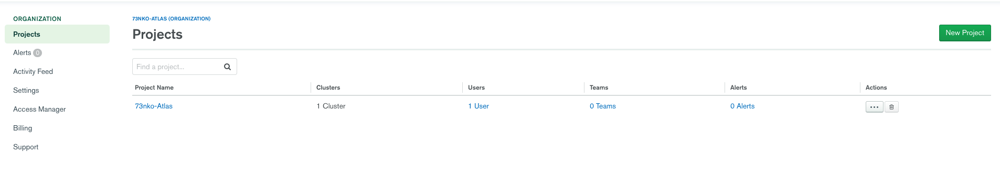
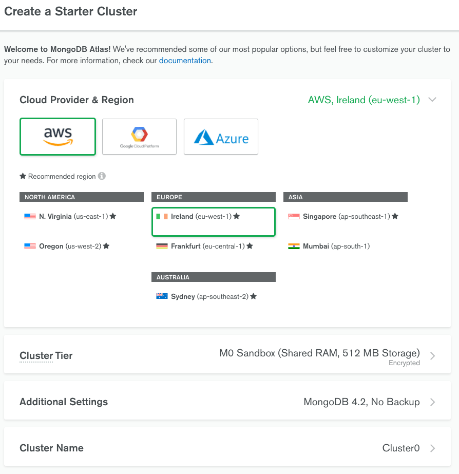
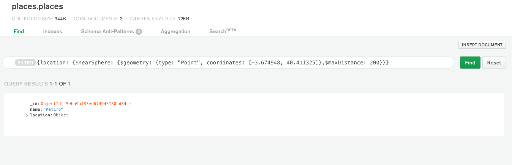

Este es el primer artículo de mi blog. Llevo más de un año con el sitio creado pero no tenía ni idea de qué escribir hasta que hoy me di cuenta de que había estado trabajando con una herramienta muy guay y poco conocida.  
  
Este será el primero de una serie de tres artículos en el que crearemos una app que nos permita buscar lugares cercanos en base a ciertas "tag"(como restaurantes, bares, etc...) y distancia máxima a la que buscar.

Pero vamos por partes, lo primero, vamos a crear nuestra base de datos.

## GeoJSON Objets

Los objetos GeoJSON no son un estándar de MongoDB, pero MongoDB soporta varios de los tipos de GeoJSON objects que existen, al menos los más importantes. Nos sirven para definir puntos en un mapa, pero también podemos definir rectas e incluso polígonos u objetos geométricos.  En la [documentación oficial](https://docs.mongodb.com/manual/reference/geojson/) podemos ver una descripción de estos objetos y cómo crearlos.  
En concreto vamos a trabajar con los más sencillos, los tipo “Point”, que representan un punto en el mapa de coordenadas.  La forma que tienen este tipo de objetos es la siguiente:  

```js
{ type: "Point", coordinates: [ -3.703339, 40.416729 ] }
```

Vemos que la propiedad `coordinates` la compone un array con dos valores numéricos, siendo siempre el primero la longitud y el segundo la latitud. En este caso estaríamos en el Parque del Retiro.


## Crear nuestra Base de datos de Mongo

Bien, sabiendo cómo es la forma que tienen que tener nuestras localizaciones, vamos a crear unas cuantas en nuestra BBDD. Para ello, podríamos usar una BBDD local pero, en lugar de ello, utilizaremos [Atlas](https://cloud.mongodb.com/), que nos permite tener nuestra propia BBDD en la nube y trabajar desde la aplicación web. Mucho más sencillo y no tenemos que complicarnos en instalar nada en nuestro equipo.

Para esto vamos a la [página de login](https://www.mongodb.com/cloud/atlas/register), nos registramos y nos encontramos un panel de administración parecido a este:  
  


Aquí creamos un nuevo proyecto, y en la ventana de nuestro proyecto creamos un nuevo Cluster seleccionando la opción gratuíta, que es mas que suficiente para nuestra prueba y, por último, nos permite elegir el proveedor en el que queremos elegir nuestro cluster junto a la región. Las demás opciones podemos dejarlas por defecto.  
  


Nuestro siguiente paso será crear un usuario para nuestra BBDD. Hacemos click en `connect` y rellenamos con la información de nombre de usuario y password. No lo olvides porque lo vamos a necesitar más adelante!

## Insertamos nuestras primeras localizaciones

Ya estamos listos para insertar una localización. Para ello, vamos a clickar en colecciones. Creamos una Database con el nombre de `test` y un una nueva colección, `places` .

En esta colección, añadimos un nuevo documento. Vamos a añadir El parque del Retiro, en Madrid.

```js
{
    "name": "Parque del Retiro",
    "location": {
        "type": "Point",
        "coordinates": [-3.674908, 40.411335]
    }
}
```

Como ves, le añadimos un nombre y un objeto location, que tiene la forma del GeoJSON que vimos al principio. El tipo nos indica que es un punto y el objeto de coordenadas refieren la longitud y latitud a la que se encuentra nuestra localización.

Vamos a añadir un par más para poder jugar un poco!

```js
{
    "name": "Puerta del Sol",
    "location": {
        "type": "Point",
        "coordinates": [-3.703339, 40.416729]
    }
},
{
    "name": "Palacio Real",
    "location": {
        "type": "Point",
        "coordinates": [-3.7083305, 40.41749833]
    }
}
```

## Buscando lugares cercanos

Ahora que tenemos algunos lugares en nuestra base de datos, vamos a introducir nuestra primera Geospatial Query.

Para ello vamos a utilizar el operador `$nearSphere`. Este operador nos permite buscar objetos en proximidad a un punto en una esfera en base a sus coordenadas. Este operador tiene una propiedad `$geometry`  obligatoria que recibir un GeoJSON de tipo punto y puede recibir una distancia máxima a la que buscar (`$maxDIstance`) y una distancia mínima (`$minDistance`).

```js
{
  "location": {
    "$nearSphere": {
      "$geometry": {
        "type": "Point",
        "coordinates": [-3.674948, 40.411325]
      },
      "$maxDistance": 200
    }
  }
}
```
  
Lanzamos la query y… <span style="font-size: 2.3rem; color: #D20000">ERROR!</span> La aplicación nos dice algo de que no puede encontrar un índice. Si vamos a la [documentación oficial](https://docs.mongodb.com/manual/reference/operator/query/nearSphere/#op._S_nearSphere) podemos ver que el operador `$nearSphere` necesita de un índice geo espacial. Este tipo especial de incides calcula geometrías en una esfera como es nuestro planeta (A ver como explicáis esto los terraplanistas).

Para crear esté índice es muy sencillo. Vamos a la pestaña de `Indexes` pulsamos en CREATE INDEX y añadimos

```js
{ "location": "2dsphere" }
```

Donde location hace referencia a nuestra propiedad donde estamos añadiendo nuestro GeoJSON object y `2dsphere` es el tipo de índice.

Con nuestro incídete creado, volvemos a hacer nuestra búsqueda:



<span style="font-size: 2.3rem; color: var(--main-color)">Boom!</span> Esta vez nos devuelve los lugares que están a menos de 200m del punto de coordenadas por el que buscamos! En este caso, el Parque del Retiro.

Ya tenemos nuestra colección de lugares funcionando y hemos aprendido a buscar. En el siguiente artículo crearemos una API con Node que nos permitirá hacer búsquedas directamente sin utilizar la app web de atlas.
