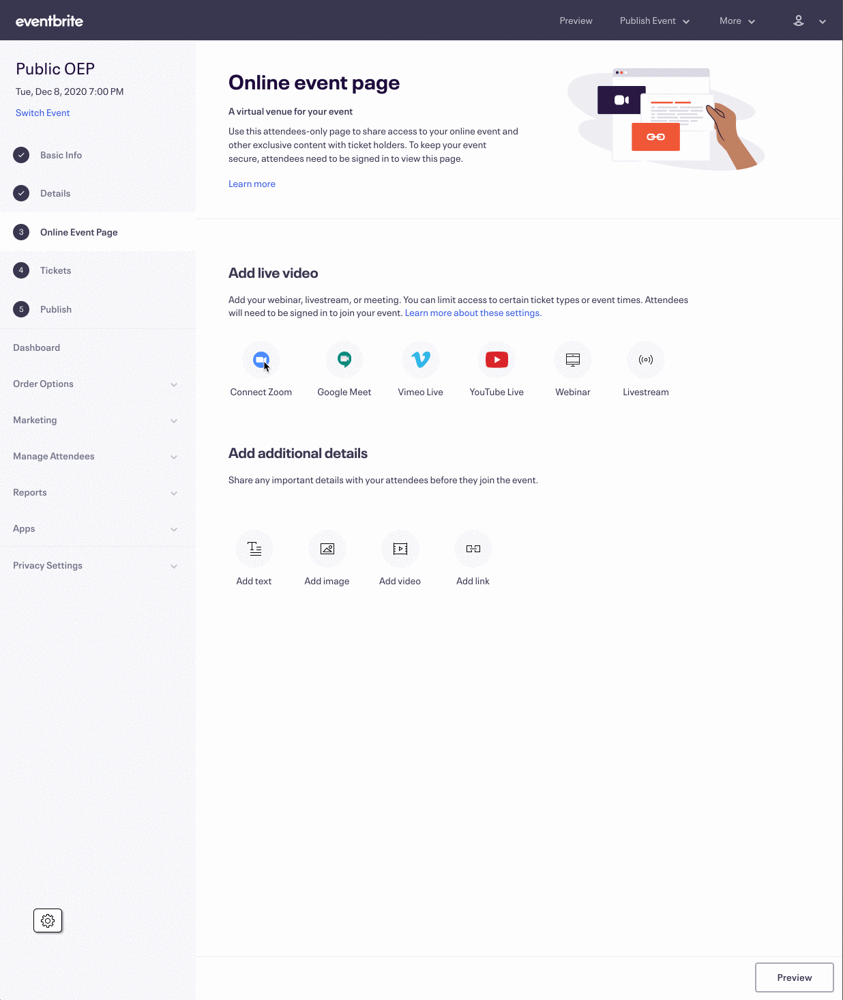

Pues como cabría esperar de mi, después de dos artículos me he tirado meses sin escribir nada. La verdad que no soy muy imaginativo pensando temas sobre los que escribir pero, esta semana he tenido un problema en el trabajo que he resuelto de una forma bastante elegante y creo que puede ayudar.

## Comunicar información entre ventanas

Os pongo en situación, estoy integrando un módulo en la creación de eventos online de la web de [Eventbrite](https://www.eventbrite.com/) que comunica con la [API de Zoom](https://marketplace.zoom.us/docs/api-reference/zoom-api). Para utilizarla, necesita que el usuario haga login y así tener un token que enviar con la API y poder acceder a los datos del usuario. 

La forma que Zoom te propone hacer este login es a través de un enlace a su web, donde el usuario se logearía y te redirecciona a la página que tu le hayas indicado con el token como parámetro en la URL. 

El problema es que el punto en el que se pide hacer login con zoom dentro de mi app es a mitad de creación de un evento, cuándo el usuario ya lleva varias páginas rellenas de información y no es de recibo sacar al usuario del flujo para que haga login y luego devolverle a donde estaba. Así que la solución es muy fácil, abrir una nueva ventana donde se cargue el login de Zoom y una vez terminado el proceso la ventana se cierre y mi flujo principal actualice con los datos del usuario que necesito. 



Bueno, la solución me parece bastante elegante, pero me surgen bastantes incógnitas. La primera es, ¿cómo podemos abrir una `nueva ventana desde react`?

## Abrir una nueva ventana con React

La forma que me pareció más sencilla es a través de un componente, por suerte ya lo tenía de un desarrollo anterior para una devtool, así que pude reutilizarlo. Sería algo así:

```js
import React from 'react';
import PropTypes from 'prop-types';
import ReactDOM from 'react-dom';
export const ZoomLoginWindow = ({
    children,
    closeWindowPortal,
    windowTitle = '',
    redirectURL = '',
    windowOptions = 'width=800,height=600,left=200,top=200',
}) => {
    const containerEl = React.useRef(document.createElement('div'));
    const externalWindow = React.useRef(null);


    React.useEffect(() => {
        const loginWindow = (externalWindow.current = window.open(
            redirectURL,
            windowTitle,
            windowOptions,
        ));

        if (loginWindow) {
            loginWindow.addEventListener('beforeunload', closeWindowPortal);
            loginWindow.document.body.appendChild(containerEl.current);
        }

        return () => {
            loginWindow?.removeEventListener('beforeunload', closeWindowPortal);
            loginWindow?.close();
        };
    }, [closeWindowPortal, redirectURL, windowOptions, windowTitle]);


    return ReactDOM.createPortal(children, containerEl.current);
};


ZoomLoginWindow.propTypes = {
    children: PropTypes.node,
    closeWindowPortal: PropTypes.func.isRequired,
    redirectURL: PropTypes.string,
    windowTitle: PropTypes.string,
    windowOptions: PropTypes.string,
};
```

Este componente crearía una nueva ventana que se abriría al montarse, añade un div conectado a nuestra aplicación principal a través de un [portal de react](https://es.reactjs.org/docs/portals.html) y tiene un evento de cerrado para avisar a su padre que se ha cerrado. 

Mola mucho porque al crearse un portal, podemos mantener la comunicación entre las dos ventanas como si se tratase de un componente más dentro de nuestro dom de react. Lamentablemente, no nos sirve en nuestro problema porque Zoom nos redirecciona a una página propia y, obviamente ellos no tienen un portal a nuestra aplicación de react, así que tenemos que buscarnos otra alternativa para comunicarnos entre ventanas.

## Usando el LocalStorage para comunicar eventos entre dos ventanas.

Existen varias formas de comunicar entre ventanas. La más moderna y más guay probablemente sea con la nueva API del [Broadcast Channel](https://developer.mozilla.org/en-US/docs/Web/API/Broadcast_Channel_API). Esta API permite comunicar de forma muy sencilla con un patrón como este:

```js
var bc = new BroadcastChannel('test_channel');

bc.postMessage('This is a test message.'); /* send */

bc.onmessage = function (ev) { console.log(ev); } /* receive */
```

Pero tenemos el problema de siempre con este tipo de APIs nuevas y súper cools, Internet Explorer no sabe ni de que le estás hablando y, en este caso, Safari tampoco. [Aquí](https://caniuse.com/?search=broadcast) podemos ver la implementación actual de la API en navegadores.

Así que hay que buscar formas más rudimentarias y, para eso tenemos el `LocalStorage`. De esto sí que hay una implementación total y nos sirve perfectamente para nuestro propósito que al final es, hacernos con el token de sesión de Zoom. 

Vamos a necesitar dos partes.En un lado, tendremos un componente que es donde Zoom nos va a redireccionar una vez terminado el proceso de Login, dándonos el token en la URL. En este componente vamos a coger el parámetro del token, guardarlo en el `LocalStorage` y cerrar la ventana.

```js
import React from 'react';

export const CompleteProccess = () => {
    
    const [error, setError] = React.useEffect(false)

    React.useEffect(() => {
        const currentUrl = new URL(window?.location);
        const codeParam = currentUrl.searchParams.get('token');
        if (codeParam) {
            localStorage?.setItem(LOCAL_STORAGE_KEY, codeParam);
            window?.close();
        }

        if (!codeParam) setError(true);

    }, []);

    return error ? <div>Something went wrong 😢 </div> : <div>Login process completed 👏 </div>
});

```


Para la otra parte, encargada de escuchar cuándo se va a escribir en el localStorage y actualizar el estado, vamos a utilizar un `react hook`, que podremos reutilizar en cualquier componente.

```js
import React from 'react';
export const useDetectStorageChange = (storageKey) => {


    const detectChange = React.useCallback(() => {
        const code = localStorage.getItem(storageKey);
        if (code) {
            setValue(code);
            localStorage.removeItem(storageKey);
        }
    }, [storageKey]);

    React.useEffect(() => {
        const currentWindow = appWindow.current;
        currentWindow.addEventListener('storage', detectChange);
        return () => {
            currentWindow.removeEventListener('storage', detectChange);
        };
    }, [detectChange]);

    return value;
};
```

Este `hook` escuchará cualquier evento de seteado en el LocalStorage y, en caso de que el elemento que hayamos guardado, tenga la clave que buscamos, actualizará nuestro estado interno de react y se encargará de limpiar el localStorage para no dejar basura. 


Esto sería todo lo que os quería contar. Realmente hay bastante documentación al respecto sobre como comunicar información entre ventanas, pero no encontré en ningún lado donde lo hicieran con react, y menos con un react moderno que utilice hooks, portals, etc.. Espero que os sea de utilidad. A disfrutar! 